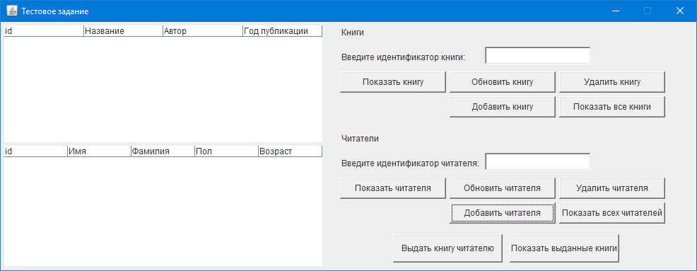
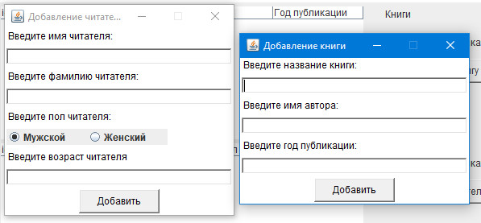
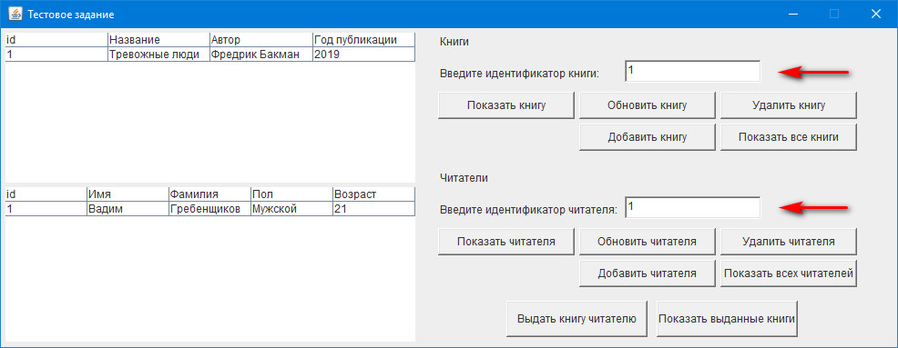
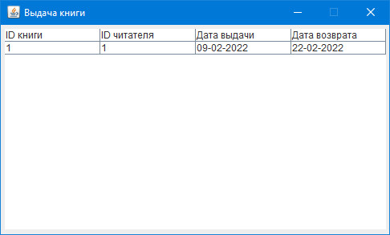

# Тестовое задание - приложение для автоматизации работы библиотеки

---

#Инструкция по запуску

##Приложение протестировано на: 
+ ###Версии Java - 16
+ ###Операционной системе - Windows 10
+ ###IDE - IntelliJ IDEA 2021.3.1

##Исходный код следует скачать и запустить в соответствующей IDE

---

#Справка по использованию приложения

###Стартовое окно приложения:
В начале работы необходимо добавить книгу и читателя (одного или несколько)

###Окна для добавления книги и читателя:

###Стартовое окно после записи нескольких элементов:
После добавления и ввода идентификатора книги и читателя появляется возможность изменять/удалять/одновлять 
нужную запись в базе данных

###Окна для выдачи книги конкретному читателю и просмотра журнала выдачи:

